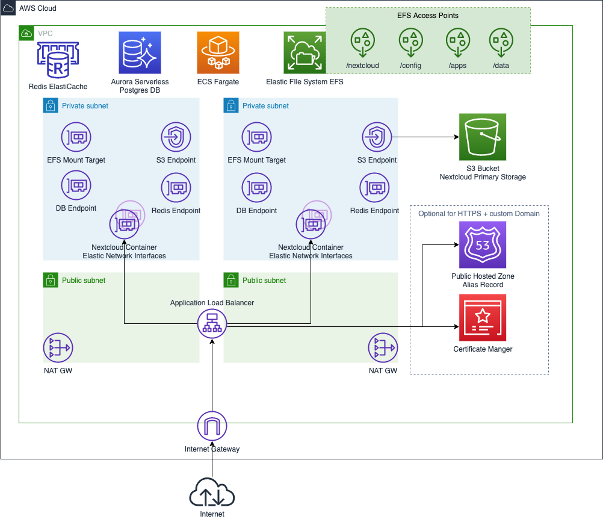
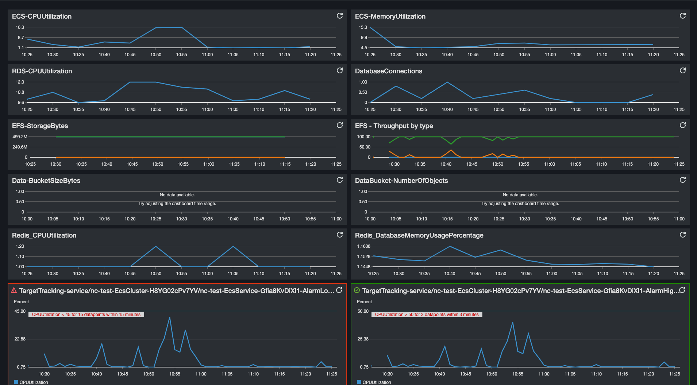

# Nextcloud Container Deployment on AWS - 100% Serverless

## Welcome

This repository provides AWS CloudFormation templates to deploy NextCloud on AWS completely.
No need to manage servers or manually react to monitoring events with adding capacity manually.

## AWS Services & How they match the NextCloud design

* Elastic Container Service - Fargate
    * Running and scaling the official nextcloud docker container (Apache, PHP)
* Elastic Filesystem - NFS
    * Persist basic settings and configuration, support official nextcloud upgrade mechanism
* Amazon S3
    * Primary data storage for cloud native data handling (archiving, tiering, versioning)
* RDS Aurora Serverless - RDS (Postgres)
    * Cloud native full managed auto-scaled database system backing the nextcloud installation
* ElastiCache - Redis
    * Handles PHP Sessions to enable container cluster to scale easily without interruption for end-users
* Application Load Balancer, Route53, Amazon Certificate Manager
    * Secures the application with HTTPS, balances load, performs health checks, auto-certificate renewal

## Quickstart

[Quickstart CloudFormation Link](https://console.aws.amazon.com/cloudformation/home?region=eu-west-1#/stacks/new?templateURL=https:%2F%2Fs3.amazonaws.com%2Ff7o-quickstart%2Faws-serverless-nextcloud%2Fecs-nextcloud.yml)

## Deployment

This project assumes a familiarity with AWS CLI and AWS CloudFormation. Additional reference can be found at the following links:
[https://aws.amazon.com/cli/](https://aws.amazon.com/cli/)
[https://aws.amazon.com/cloudformation/](https://aws.amazon.com/cloudformation/)

* If you have never used AWS ECS within your AWS Account before, create the Service-Linked Role before going on. See the official [AWS Documentation](https://docs.aws.amazon.com/AmazonECS/latest/developerguide/using-service-linked-roles.html#create-service-linked-role)
* `aws cloudformation package --template-file ecs-nextcloud.yml --s3-bucket <cfn-artifact-bucket-name> --output-template-file packaged.yaml `
* Deploy packaged CloudFormation file (`packaged.yaml`) with appropriate parameters
  * For example using `aws cloudformation deploy --template-file packaged.yaml --stack-name nextcloud-test-env --parameter-overrides DbPassword=<DB-Admin-Password> NextCloudAdminPassword=<Nextcloud-Admin-Password> IsolationLevel=Public --capabilities CAPABILITY_IAM`
* The VPC setup has three levels of isolation
  * `Public` places containers within the public subnets
  * `Private` places containers into private subnets, deploys one NAT Gateway for outbound internet access
  * `PrivateHA` same as privat, but deploys two NAT Gateways
* After the CloudFormation Stack is deployed successfully it takes up to 15min for the frontend being available initially
* Find the Nextcloud URLs within the CloudFormation Outputs

## Architecture

## Sizing

The recommendation is to use the at least the default values to get decent performance (`cpu: 1024, mem: 2048`).
A desired container capacity of 2 allows scaling and re-deployment without downtime. For initialization go with a single container to avoid clashes when copying files during the setup phase.

The baseline cost drivers are the AWS RDS database, ElastiCache Redis and Fargate task costs. Find the hourly charged costs for your AWS region within the AWS pricing pages:
* Check per ACU (Auora Capacity Unit) costs https://aws.amazon.com/rds/aurora/pricing/
* Fargate Pricing https://aws.amazon.com/fargate/pricing/
* ElastiCache Redis Pricing https://aws.amazon.com/elasticache/pricing/

## How to upgrade Nextcloud to newer version

1. Create backups of RDS and EFS
2. Suspend AutoScaling using the CloudFormation parameter
3. Scale in to 1 task (set desired ECS capacity to 1)
4. Update CFN stack with new version number
5. Wait for Nextcloud to become available
6. Verify the upgrade was successful
7. Scale out service to desired size and disable AutoScaling suspension

## Future Work

* Enhanced monitoring for fine granular auto-scaling (ECS)
* Enable WebCron
* Whenever Nextcloud supports it 
  * Use short-term credentials instead of IAM User for S3 access
  * Redis Cluster Support

## Monitoring

Sample CloudWatch Dashboard pre-configured with basic metrics will be deployed within CloudFormation

### Note:

* **While code samples in this repository has been tested and believe it works well, as always, be sure to test it in your environment before using it in production!**
* It is highly recommended to change the administrator password after initial deployment
* While the `Public` VPC isolation level is the most cost efficient one, the suggestion is, for production workloads keep instances and containers in private subnets. This lowers risk, e.g. opening up ports with wrongly configured inbound port on VPC security groups.

## Security

See [CONTRIBUTING](CONTRIBUTING.md#security-issue-notifications) for more information.

## License

This library is licensed under the MIT-0 License. See the [LICENSE](LICENSE) file.

**This deployment references the official [Nextcloud Docker image](https://github.com/nextcloud/docker) which is published under [AGPL-3.0 License](https://github.com/nextcloud/docker/blob/master/LICENSE.md).**